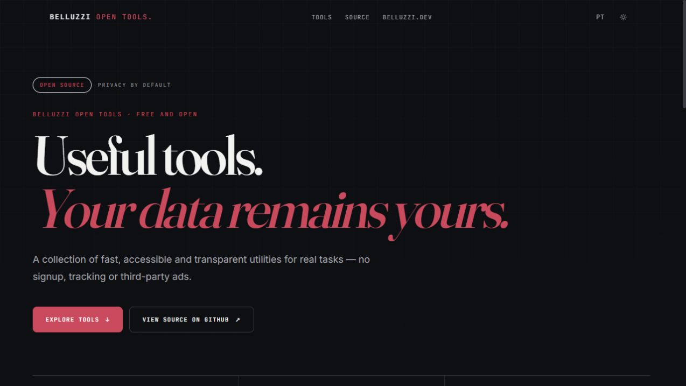
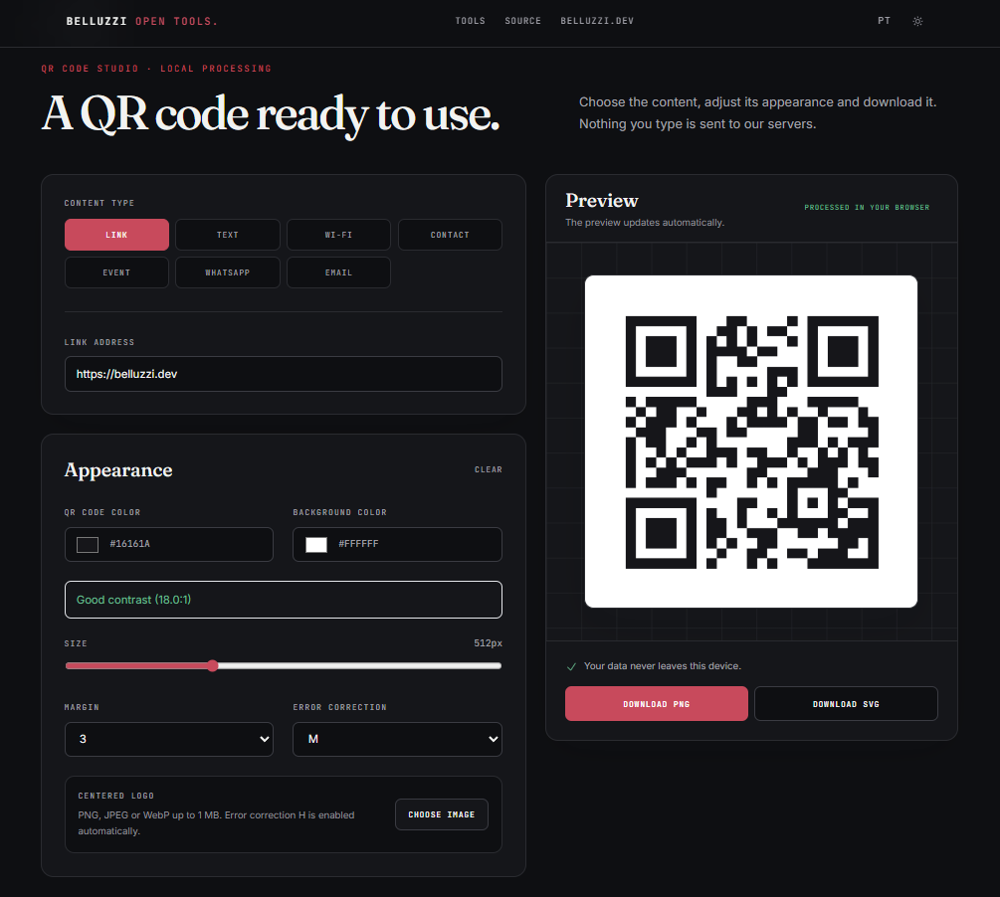
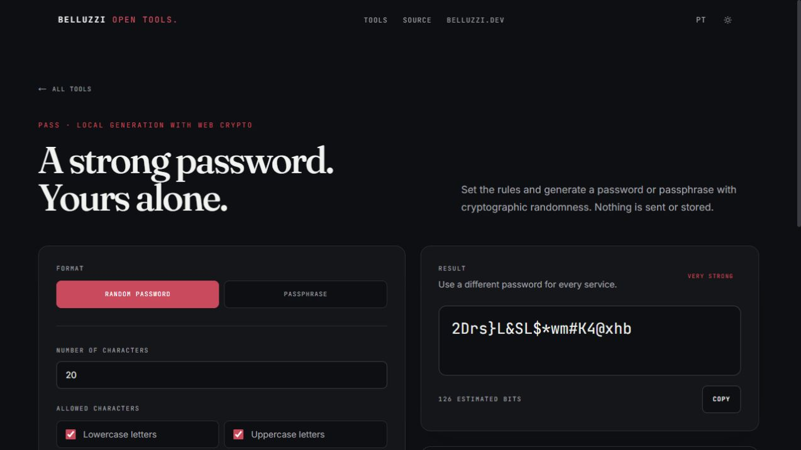
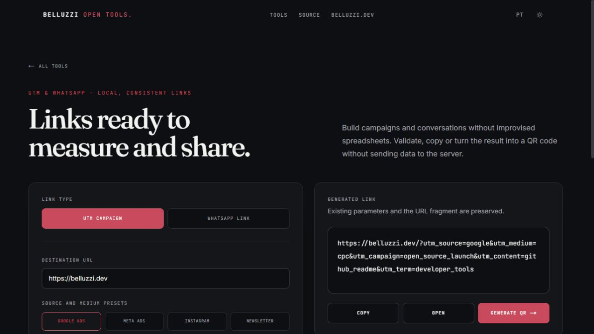
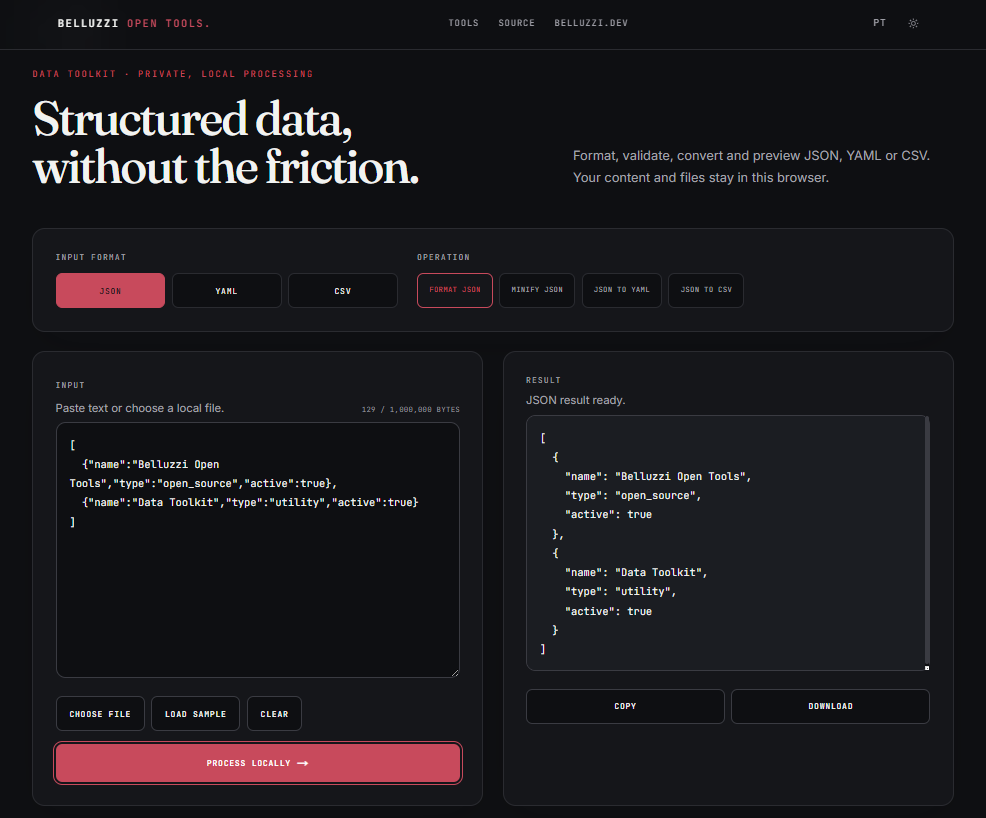

# Belluzzi Open Tools

Free, open source, privacy-first tools maintained by
[Belluzzi](https://belluzzi.dev).

The project follows the visual identity of the main Belluzzi website and
supports light and dark themes, Brazilian Portuguese, and English.

[](https://github.com/heron-belluzzi/belluzzi-open-tools/actions/workflows/ci.yml)
[](https://github.com/heron-belluzzi/belluzzi-open-tools/releases/latest)
[](LICENSE)
[](https://tools.belluzzi.dev/en)

[](https://tools.belluzzi.dev/en)

<p align="center">
  <a href="https://tools.belluzzi.dev/en">Live toolkit</a> ·
  <a href="https://tools.belluzzi.dev/en/qr">QR Code Studio</a> ·
  <a href="https://tools.belluzzi.dev/en/pass">Pass</a> ·
  <a href="https://tools.belluzzi.dev/en/utm">UTM &amp; WhatsApp</a> ·
  <a href="https://tools.belluzzi.dev/en/data">Data Toolkit</a> ·
  <a href="https://tools.belluzzi.dev/en/check">SiteCheck</a>
</p>

## Product tour

<table>
  <tr>
    <th width="50%">QR Code Studio</th>
    <th width="50%">Pass</th>
  </tr>
  <tr>
    <td>
      <a href="https://tools.belluzzi.dev/en/qr">
        
      </a>
    </td>
    <td>
      <a href="https://tools.belluzzi.dev/en/pass">
        
      </a>
    </td>
  </tr>
</table>

### UTM & WhatsApp

[](https://tools.belluzzi.dev/en/utm)

### Data Toolkit

[](https://tools.belluzzi.dev/en/data)

## Available tools

- Tool hub at `/pt` and `/en`.
- QR Code Studio at `/pt/qr` and `/en/qr`.
- QR codes for URLs, text, Wi-Fi, vCards, events, WhatsApp, and email.
- Custom colors, size, margin, and error correction.
- Centered logo with stronger error correction and contrast validation.
- PNG and SVG export.
- Random password generator with configurable rules and Web Crypto.
- Passphrase generator with Portuguese and English BIP39 wordlists.
- Transparent entropy estimates, security guidance, and quick copying.
- UTM campaign links with built-in presets and consistent naming.
- Official WhatsApp links with phone normalization and message preview.
- One-time, session-only handoff from campaign links to QR Code Studio.
- JSON formatting, validation, minification, and conversion to YAML or CSV.
- Safe YAML-to-JSON parsing and CSV-to-JSON conversion with table preview.
- Local file reading, copying, and downloads with a 1 MB safety limit.
- Actionable HTTP, TLS, security header, SEO, robots.txt, and sitemap.xml
  diagnostics with strict SSRF and resource-abuse protection.
- Fully client-side processing with no persistence or transmission of tool
  content.

## Requirements

- Node.js 22 or newer.
- npm 10 or newer.

## Development

```bash
npm install
npm run dev
```

The application will be available at `http://localhost:3000`.

## Quality checks

```bash
npm run lint
npm run typecheck
npm test
npm run build
npm run test:e2e
```

## Docker

```bash
docker compose up --build
```

By default, Docker Compose publishes the application at
`http://localhost:3020`. Use `APP_PORT` to select a different port.

The official instance deployment procedure is documented in
[`docs/DEPLOYMENT.md`](docs/DEPLOYMENT.md).

## Short tool domains

The [`qr.belluzzi.dev`](https://qr.belluzzi.dev) alias selects its destination
according to the browser language:

- Portuguese: `https://tools.belluzzi.dev/pt/qr`;
- English: `https://tools.belluzzi.dev/en/qr`.

Language negotiation uses a `307` redirect with `Vary: Accept-Language`,
preserves the query string, and prevents shared caches from fixing one language
for every visitor.

The [`pass.belluzzi.dev`](https://pass.belluzzi.dev) alias uses the same
language negotiation and redirects to `/pt/pass` or `/en/pass`.

The [`utm.belluzzi.dev`](https://utm.belluzzi.dev) alias redirects to `/pt/utm`
or `/en/utm` using the same language and query-string rules.

The [`data.belluzzi.dev`](https://data.belluzzi.dev) alias redirects to
`/pt/data` or `/en/data` using the same negotiation rules.

After DNS and TLS activation, `check.belluzzi.dev` follows the same negotiation
and redirects to `/pt/check` or `/en/check`.

All aliases share the `tools.belluzzi.dev` application and a single
Let’s Encrypt certificate, with automatic renewal managed by CloudPanel.

## Privacy

QR Code Studio, Pass, the campaign link builders and Data Toolkit do not send
entered or generated content to an API. QR composition, cryptographic
generation, link assembly, parsing and file conversion happen entirely in the
browser. The public application requires no account and contains no third-party
ads. SiteCheck sends only the submitted public URL to the application server
for the duration of one analysis; it creates no history or public report link.

## Roadmap

1. QR Code Studio — available.
2. Password and passphrase generator — available.
3. UTM and WhatsApp link builder — available.
4. JSON, YAML, and CSV toolkit — available.
5. SiteCheck for HTTP, TLS, security headers, SEO and indexing — available.
6. Later products such as Hook.

## License

Licensed under the [Apache License 2.0](LICENSE).
